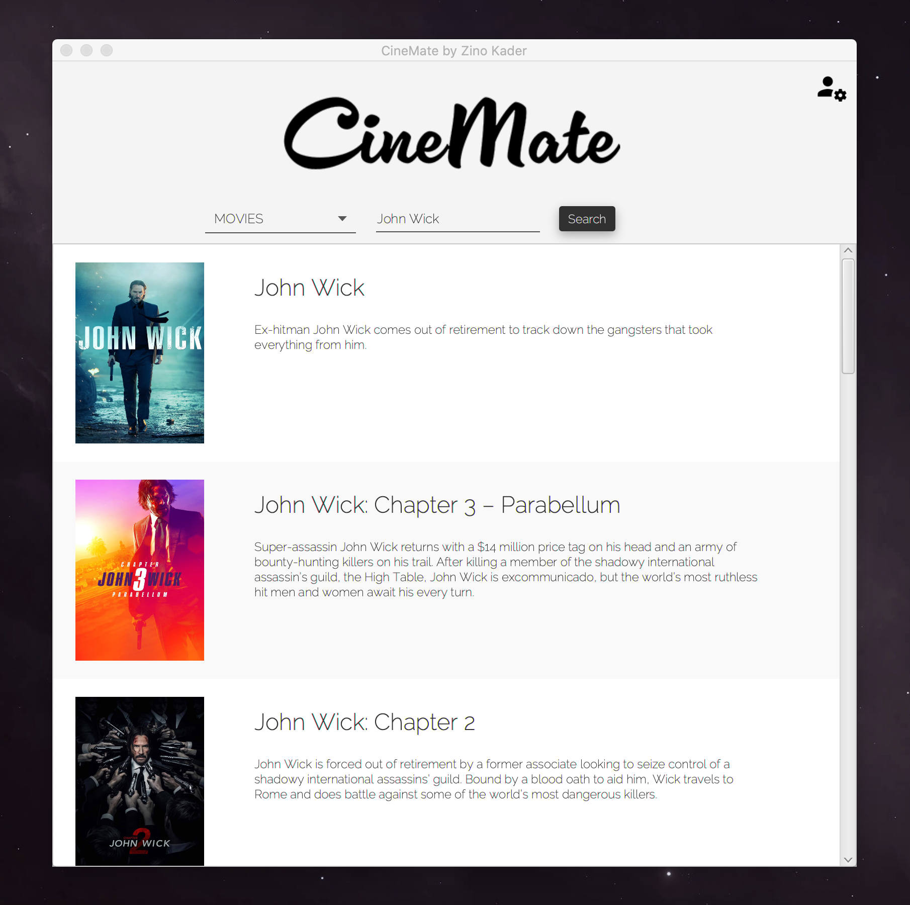

 

Download the latest release (.app for OS X) <a target="_blank" href="https://github.com/ZinoKader/CineMate/releases/download/1.0/CineMate.app.zip">here</a>!

 

CineMate is a film search engine that lets you search for movies, series, cast,
crew, directors and more. Design inspired by Google's material design ensures that
you'll be browsing for movies with style.

Made for the course Object Oriented Programming in Java (TDDD78).

Built using
----

  
  |  |  |
  | ------ | ------ |
  | Retrofit | [Retrofit on GitHub](https://github.com/square/retrofit) |
  | Gson | [Gson on GitHub](https://github.com/google/gson)|
  | TMDB API | [TMDB API Overview](https://www.themoviedb.org/documentation/api) |
  | JavaFX | [JavaFX docs](http://docs.oracle.com/javase/8/javase-clienttechnologies.htm)  |
  | <i>Magic</i> | [Enter the magic](https://www.zinokader.se) |
  |  |  |

